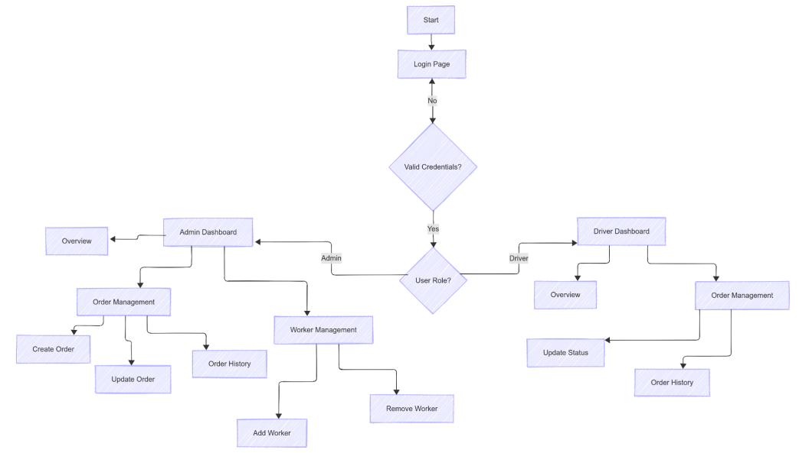
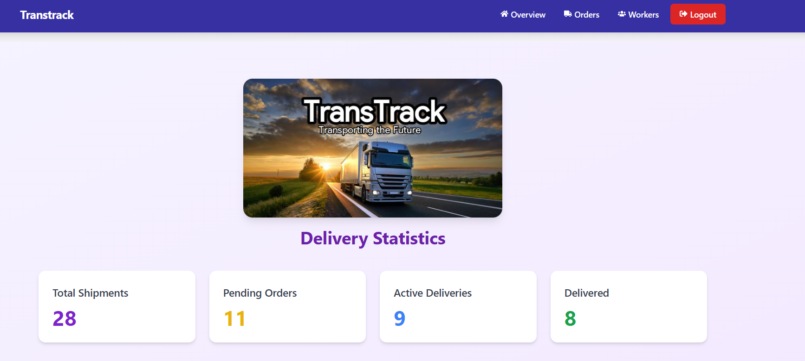
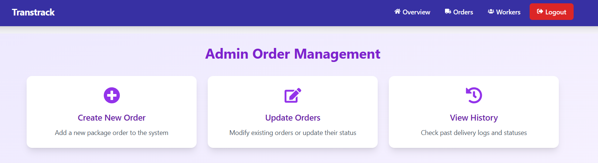
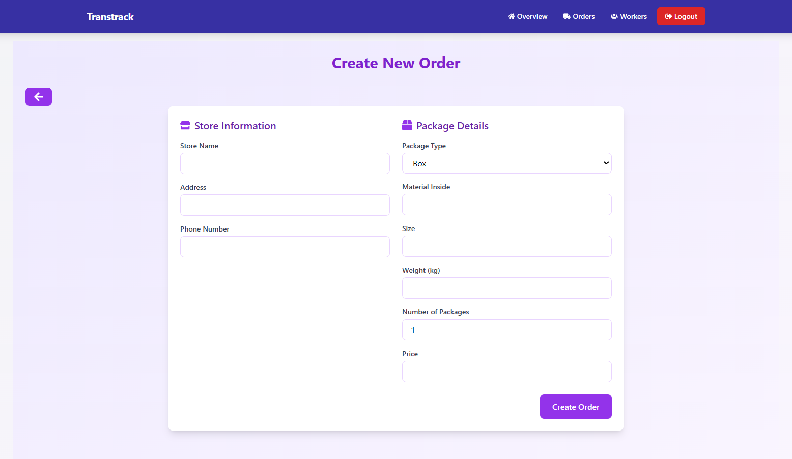
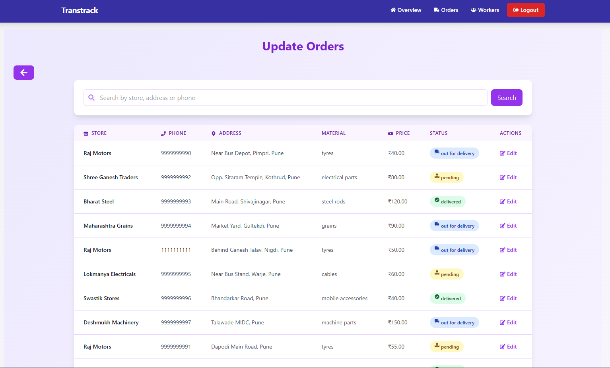
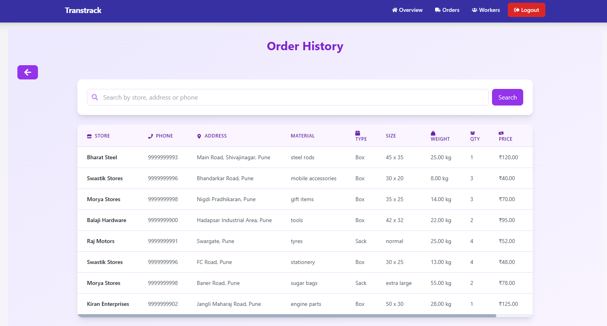
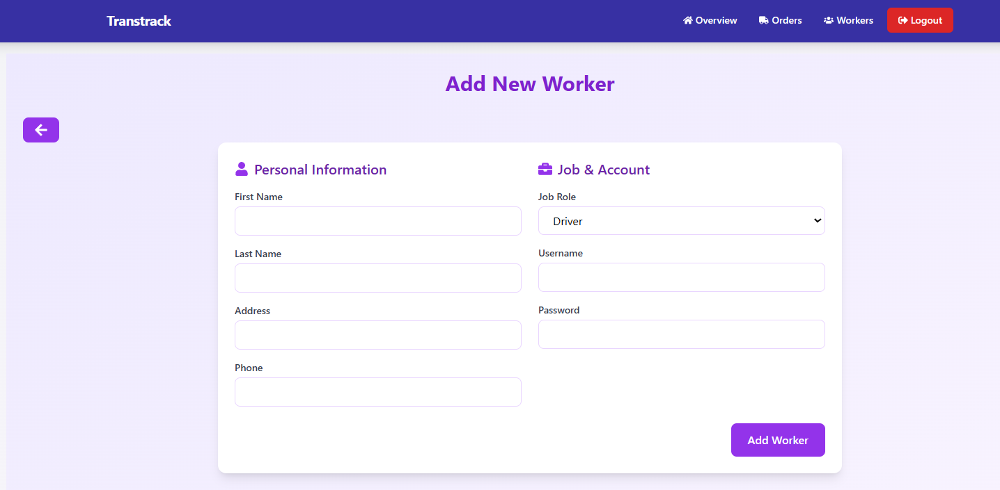
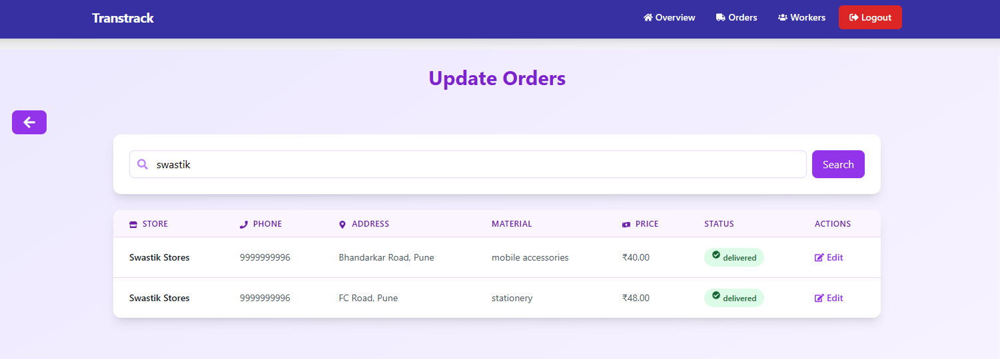

# TransTrack – Goods and Packages Management System

## Abstract

The creation of the full-stack goods and packages management system **TransTrack** for transportation companies is described in this study. The system offers a complete solution for personnel (drivers and porters), shipment management, and shipping status tracking. Role-based access control and distinct dashboards for administrators and drivers are aspects of the program, which was developed with a **React.js frontend (using Vite)**, a **Node.js backend**, and a **MySQL database**.

The solution increases workforce management skills, expedites package management processes, and boosts delivery tracking effectiveness.

**Keywords:** Transportation Management, Full-stack Development, React.js, Node.js, MySQL, Role-based Access Control, Package Tracking, Logistics Management.

---

## I. Introduction

TransTrack addresses major inefficiencies in traditional logistics operations. The system automates shipment tracking, facilitates communication, and provides real-time updates via web dashboards, increasing accuracy and security with a clear separation between admin and driver roles.

---

## II. Objective

- Develop a secure, role-based web application for transportation companies.
- Enable real-time package tracking and delivery status updates.
- Provide intuitive dashboards for admins and drivers.
- Implement efficient worker (driver/porter) management.
- Categorize shipments as: pending, out for delivery, or delivered.

---

## III. Literature Survey

Traditional tools (manual logs, spreadsheets) are inefficient and error-prone. Complex commercial logistics platforms are too costly or inflexible for small businesses. The paper supports using modular, scalable full-stack tools like **React.js** and **Node.js** for cost-effective logistics solutions with real-time delivery updates and secure, role-based access.

---

## IV. Designed and Proposed Solution

**Architecture:**
- **Frontend:** React.js + Vite
- **Backend:** Node.js + Express.js
- **Database:** MySQL

**Key Features:**
1. Role-based authentication (admin/driver)
2. Package management: create, update, track
3. Worker admin: add/remove drivers or porters
4. Real-time status views
5. Search functionality
6. Responsive UI design

This modular and scalable setup allows future extensions like GPS, mobile app, and analytics.

---

## V. Project Flowchart


---

## VI. Web Page Overview

### Admin Dashboard
- Overview of shipment statuses
- Add new package orders
- Update package delivery status
- View delivered packages
- Add/remove employees

### Driver Dashboard
- Access to shipment overview
- Update delivery status
- View order history



### Order Management for Owner


### Creating New Order


### Updating Order


### Order History


### Add New Worker


### Efficient Searching


---

## VII. Implementation Details

### Database
- MySQL database: `transtrack`
- Tables: `workers`, `packages`

### Backend
- Express.js server
- RESTful API with controllers:
  - Authentication
  - Package operations (CRUD)
  - Worker management
- Middleware for validation, authentication, and role authorization

### Frontend
- Built with React.js (Vite)
- Components for:
  - Login
  - Admin/Driver Dashboards
  - Package management
  - Worker management
- Context API for state management
- Responsive design via CSS modules (tailwind)
- Axios for secure API communication

---

### Starting the Project

1. Connect the MySQL database by executing the SQL script located at `./transtrack/db.sql` using MySQL Workbench (or any MySQL client).

2. Open two terminal windows.

3. In the **first terminal**, navigate to the `./transtrack/` folder and run the frontend:

   ```bash
   cd frontend
   npm install
   npm run dev

4. In the **second terminal**, navigate to the `./transtrack/` folder and run the backend:

    ```bash
    cd backend
    npm install
    npm start

5. Open the web page using provided link or at 
    ➜  Local:   http://localhost:5173/
    ➜  Network: http://192.168.132.84:5173/

---

## VIII. Result Analysis

- Role-based routing and permissions are functioning as intended.
- Real-time delivery updates are reflected immediately.
- Worker admin features allow seamless onboarding/removal.
- Search functionality enhances user efficiency.
- Responsive design ensures usability across devices.
- Backend performs CRUD operations efficiently under moderate load.

---

## IX. Discussion

### Key Achievements:
One of the major accomplishments of this project is the development of an intuitive and visually
appealing user interface. The design ensures that both admins and drivers can quickly learn and
navigate the system with minimal training, which is crucial in real-world logistics environments.
The integration of real-time status updates has significantly improved operational visibility,
allowing managers to instantly view the current state of shipments—whether pending, out for
delivery, or completed. This level of transparency supports faster decision-making and better
coordination across the organization. Additionally, implementing a role-based access system has
enhanced the platform’s overall security and usability by restricting functions based on user
roles, thus ensuring that sensitive operations like adding/removing workers or modifying order
details remain limited to admin access.


### Challenges:
Throughout the development process, several technical challenges emerged. One of the more
significant issues was managing complex application state in React, especially when handling
dynamic form inputs for order creation and updates. Ensuring that data remained consistent
across components required careful planning and the use of context and state management tools.
On the backend, optimizing MySQL database connection pooling posed performance hurdles,
particularly during high-load operations. Ensuring that the server handled multiple simultaneous
requests efficiently without dropping connections or slowing down required the right
configuration and use of connection pooling libraries. Furthermore, designing a responsive UI
that worked seamlessly across various screen sizes and devices added an additional layer of
complexity. Balancing aesthetics with functionality, especially for nested dashboard layouts,
required continuous testing and CSS refinements.

- React state management complexity
- MySQL connection pooling under load
- Responsive dashboard design

### Future Enhancements:
1. Mobile app integration
2. GPS-based tracking
3. Customer notifications
4. Advanced analytics

---

## X. Conclusion

**TransTrack** TransTrack provides a comprehensive solution for transportation businesses to manage their
goods and packages efficiently. The system's role-based architecture, intuitive interface, and
robust functionality make it suitable for small to medium transportation operations. The
successful implementation demonstrates the effectiveness of the chosen technology stack (React,
Node.js, MySQL) for such applications.
The project meets all specified requirements while maintaining code quality, security standards,
and performance benchmarks. The consistent color scheme and responsive design contribute to a
positive user experience.

---

## XI. Reference Apps

1. ShipStation – Package management
2. ShipBob – Logistics platform
3. UPS Dashboard – Package tracking
4. FedEx Manager – Delivery management

---

